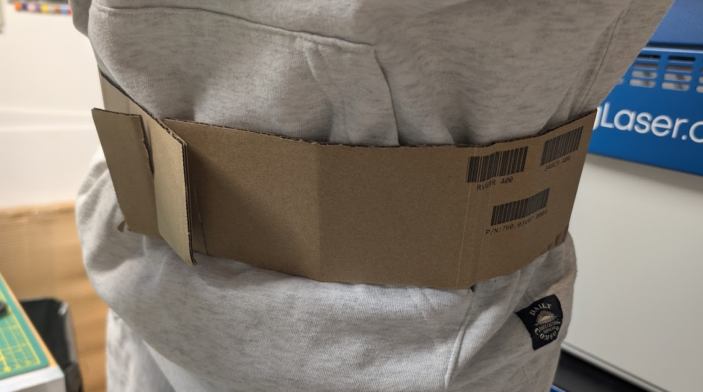
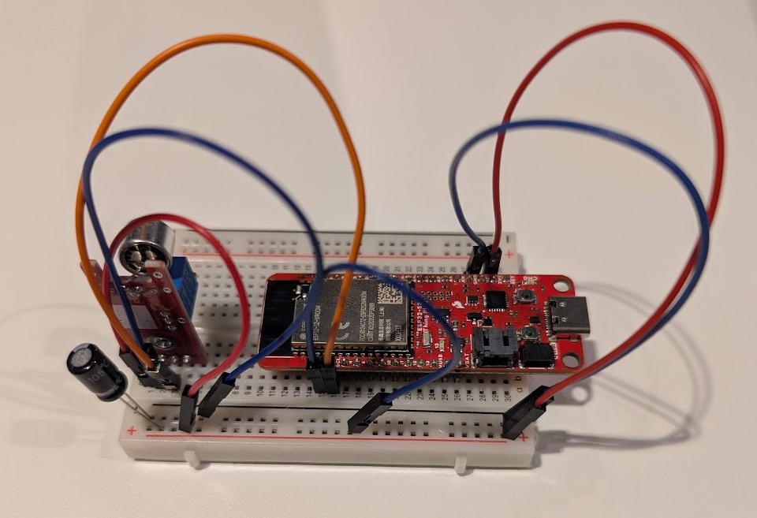
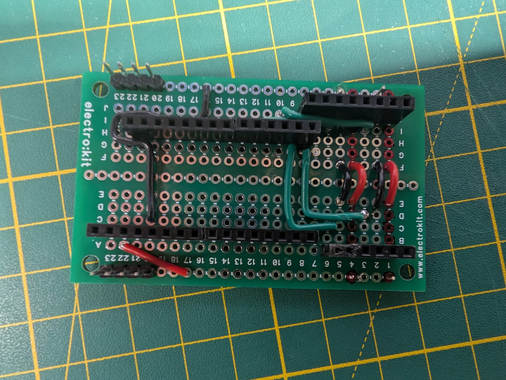
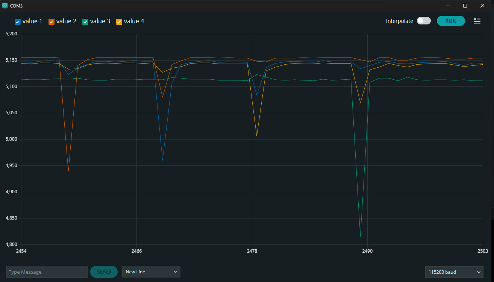
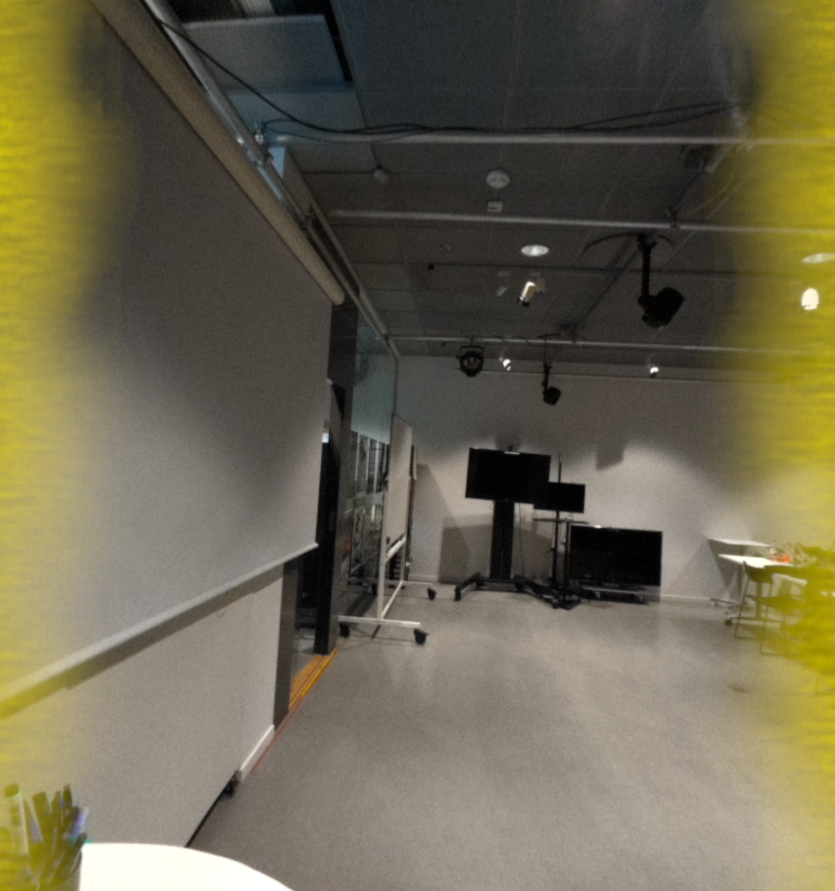
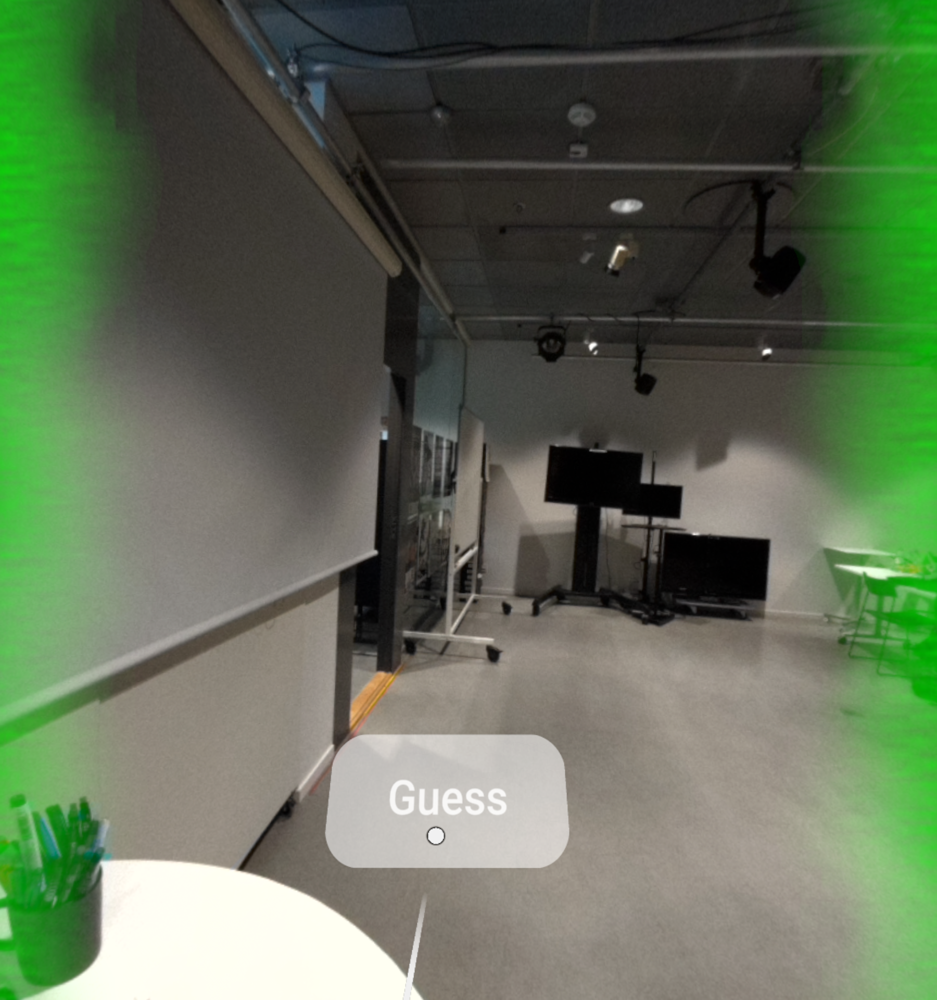

# EchoView

## Introduction

EchoView is an educational XR experience, designed for people with low-hearing capabilities, that visually guides users to an audio source, which is emitting sound nearby them. This experience also features a mini-game, which is be accessible to everyone. In particular, the mini-game challenges the user to find the audio source without the aid of visual feedback.

The problem detected was centered on the challenges that people with hearing impairments face in responding to sound interactions. In everyday life, people are often immersed in environments that have multiple sound interactions. For instance, a person in a room could be able to hear other people trying to speak to him, objects falling, a door opening, etc. These actions seem normal to most of us. However, those may be very hard tasks for people that do not have full hearing capabilities.  

The proposed solution is valuable because it is a simple tool that can help people to try to overcome this problem. EchoView is capable to detect audio feedback from all the directions near the user, and give a visual feedback for him. Moreover, the minigame implemented in the experience is also valuable, as it acts as an educational experience for people which do not have hearing impairments. In fact, the minigame requires all people to wear noise-cancelling headphones, and its goal is to try to make the user guess where the audio stimuli is coming from, without the aid of EchoView's visual feedback.   

## Design Process

Since the project was developed in a short time frame, the research was only based on reviewing existing literature to find out if a project like this is feasible. In a paper focused on Head-Mounted Display Visualizations to Support Sound Awareness for the Deaf and Hard of Hearing](https://dl.acm.org/doi/10.1145/2702123.2702393), the results indicated that that XR visualizations help people with hearing impairments by making it easier to identify speakers and sounds, though preferences and social settings affect their usefulness. As the paper further suggests that future work in this field is neccessary and required, we were convinced to pursue this project further.

The hardware was designed in two separate parts, which were merged in the end to create the finished product. These are the wearable prototype, which was made out of cardboard and had the microphone mounted with cable ties, as well as a breadboard which was made to prototype the electronics.

    
    

As soon as one microphone output was obtained and could reliably detect audio peaks produced with a knife and glass, a custom board was made to accomodate all 4 microphones.
The microphones were then mounted on the prototype cardboard belt, and peaks were recorded for each microphones, which producted the following pattern.

    
    

This was deemed feasible, and the final prototype was produced, consisting of a real belt, and all the components securely mounted with cable ties.

  

[_Add evidence on the general overview of how you planned, designed, and developed your project, including the goals, challenges, and solutions._]

For example:
- Brainstorming: A screenshot of the whiteboard or post-it notes used to land the project's idea.
- User Research: Pictures and summary of how you conducted user research, such as surveys, interviews, or observations, and what insights you gained from it.
- User Persona: A description of your target user, their needs, motivations, and pain points, and how your project addresses them.
- User Journey: A visualization of how your user interacts with your project, from the initial trigger to the final outcome, and what emotions they experience along the way.
- Wireframes and Prototypes: A collection of sketches, mockups, or prototypes that show the layout, structure, and functionality of your project, and how you tested and iterated on them.

## System description

- **Real-time Audio Visualization**: The application provides intuitive visual feedback to represent audio detected by an array of microphones in real time.  
- **Intuitive Visual Feedback**: Two animated visuals appear on the left and right sides of the user's field of view. Their colors and animations change based on the position and distance of the detected sound source, making the feedback immediately understandable.  
- **Interactive Minigame**: Includes a button that users can press using ray interaction with the right controller to guess the real-world position of the detected sound.  
- **Meta Quest Compatibility**: Fully compatible with all Meta Quest headsets starting from the Quest 2.  

## Building & Installation

### Building the ESP32 project

#### Prerequisites

- The [Arduino IDE](https://www.arduino.cc/en/software) (v2.3.4)
- The [ESP32 package](https://github.com/espressif/arduino-esp32) (v3.1.1)
- The [WebSockets](https://www.arduinolibraries.info/libraries/web-sockets) library (v2.6.1)
- The [WiFiWebServer](https://docs.arduino.cc/libraries/wifiwebserver/) library (v1.10.1)

#### Deploying to an ESP32 Board

1. Open the project file `EchoView-ESP32.ino`;
2. Open the `header.h` file and initialize the variables `ssid` and `password` (lines 3 and 4) with your network name and password;
3. Compile the project by clicking the `Verify` button;
4. Connect the board to the computer and select the correct port;
5. Send the project to the board using the `Upload` button;
6. Open the serial monitor and set the baud rate to `115200 baud`;
7. Copy the IP address that will be printed once the connection is established.

### Building the Unity project

#### Prerequisites

- [Unity](https://unity.com/releases/editor/archive) (v2022.3.56f1) with the Android Build Support
- The following Meta packages (v72.0.0):
  - [Meta XR Core SDK](https://assetstore.unity.com/packages/tools/integration/meta-xr-core-sdk-269169)
  - [Meta MR Utility Kit](https://assetstore.unity.com/packages/tools/integration/meta-mr-utility-kit-272450)
  - [Meta XR Haptics SDK](https://assetstore.unity.com/packages/tools/integration/meta-xr-haptics-sdk-272446)
  - [Meta XR Interaction ​SDK](https://assetstore.unity.com/packages/tools/integration/meta-xr-interaction-sdk-265014)
  - [Meta XR Interaction SDK Essentials](https://assetstore.unity.com/packages/tools/integration/meta-xr-interaction-sdk-essentials-264559)
  - [Meta XR Platform SDK](https://assetstore.unity.com/packages/tools/integration/meta-xr-platform-sdk-262366)
  - [Meta XR Simulator](https://assetstore.unity.com/packages/tools/integration/meta-xr-simulator-266732)
  - **Note**: Installing the `Meta XR All-in-One SDK` package may cause conflicts with `NativeWebSocket`.
- The [NativeWebSocket](https://github.com/endel/NativeWebSocket) package (v1.1.5)

#### Deploying to a Meta Quest Headset

1. Open the project `EchoView-Unity`;
2. Go to `File` -> `Build settings`, select `Android` and then press the `Switch platform` button;
4. Inside the Unity editor, double-click on the `Scenes` folder and open the `MainScene`;
5. Select the `WebSocketClientManager` object in the scene hierarchy and paste the ESP-32 IP address in the appropriate field in the inspector panel;
6. Click the `Build` or the `Build and Run` buttons and choose where to save the build files (e.g. create a folder named `Build` in the project directory), write the build name and press the `Save` button;
7. If you have pressed the `Build` button, install the APK on your headset (e.g. running `adb install PATH_TO_THE_APK`).

## Usage

### Main Menu

Upon launching the application, the user is greeted with the main menu, which features two buttons:

- `Main Scene`: Enters the main experience.  
- `Game Scene`: Loads a gameplay environment.  

<!-- TODO: screenshot -->

### Main Scene

The **Main Scene** provides the core experience, allowing users to visualize audio detected by the microphones on the belt. The visualization adapts based on two key factors:

- **Direction**:
  - If the sound originates from the left or right, the corresponding side will illuminate.
  - If the sound is detected in front or behind the user, both sides will light up.
  - Front and rear sounds are distinguished by different colors.
- **Distance**:
  - Nearby sounds appear **green**.
  - Mid-range sounds appear **yellow**.
  - Distant sounds appear **red**.
  - If the noise is detected in front of the user, it always appears **green**.
  - The speed of the animation also changes based on distance.

### Game Scene

The **Game Scene** is designed for demo sessions, where the team members generates sounds from different directions, and the player must determine the source of the noise. Unlike the **Main Scene**, no visual feedback is provided in real time. Instead, the player must listen carefully and make a guess by pressing the **Guess** button. Once the button is pressed, visual feedback will be displayed for a few seconds to indicate whether their guess was correct.

## References

### Unity Assets

- [Particle Light](https://assetstore.unity.com/packages/vfx/shaders/particle-light-10105)

### Hardware

- [ESP32](https://www.sparkfun.com/sparkfun-thing-plus-esp32-s2-wroom.html)

- [Microphones](https://www.az-delivery.de/en/products/gy-max4466-mikrofonw)

- [Meta Quest 2](https://www.meta.com/se/en/quest/products/quest-2/)

### Software

- [Unity](https://unity.com/)

- [Arduino IDE](https://www.arduino.cc/en/software)

## Contributors

- Timon Léon Stojkovic
- Lorenzo Vercilli ([LinkedIn](www.linkedin.com/in/lorenzo-vercilli-71218628a))
- Davide Costantini ([LinkedIn](https://www.linkedin.com/in/davide-costantini/))
- Guilherme Lacerda Paes Dos Santos
